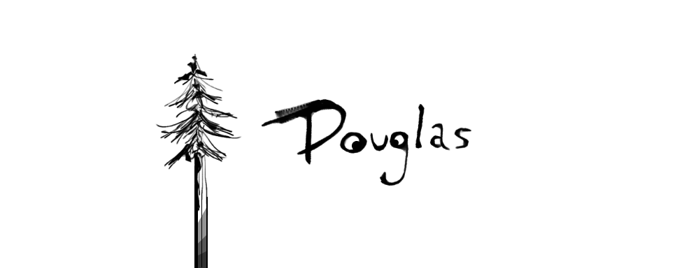

Douglas is a tiny terminal UI framework built on the [Elm architecture][elm].
It's heavily inspired by [bubbletea][bubbletea] and [iced][iced].

[elm]: https://guide.elm-lang.org/architecture/
[bubbletea]: https://github.com/charmbracelet/bubbletea
[iced]: https://github.com/iced-rs/iced

## Usage

Building a UI with Douglas is a cinch!

```rust
use douglas::{Config, Program};

struct App;

impl Program for App {
    type Message = ();

    fn view(&self) -> String {
        "Hello, world!\n".into()
    }
}

fn main() {
    App.run(&mut Config::default()).unwrap();
}
```

Granted, this isn't very exciting. Douglas apps just need 3 ingredients:

1. `init` initialize your state model, and perform any setup
2. `update` handle messages and user input
3. `view` render your UI (you've seen this already!)

```rust
use douglas::{Command, Config, Mailbox, Program};

// declare your state model
struct App {
    counter: usize,
}

// setup a constructor
impl App {
    fn new() -> Self {
        Self {
            counter: 0,
        }
    }
}

// declare message type
enum Message {
    Increment,
    Decrement,
}

impl Program for App {
    type Message = Message;

    fn init(&mut self, _: Mailbox<Self::Message>) -> Command<Self::Message> {
        // send an Increment message right away
        Command::send(Message::Increment)
    }

    fn update(&mut self, message: Self::Message) -> Command<Self::Message> {
        // you can pattern match on incoming messages
        match message {
            Message::Increment => self.counter += 1,
            Message::Decrement => self.counter -= 1,
        }

        Command::none()
    }

    fn view(&self) -> String {
        format!("count: {}\n", self.counter)
    }
}

fn main() {
    let app = App::new();
    let config = Config::default();
    app.run(&mut config).unwrap();
}
```

Finally, if you need to do any cleanup, you may implement `exit`:

```rust
use douglas::Program;

impl Program for App {
    // (...snip...)

    fn exit(self) {
        println!("Goodbye, cruel world!");
    }
}
```

## Handling Events

In addition to `update`, apps may implement `on_event` to respond to terminal
events such as keypresses:

```rust
use douglas::{Command, Program};
use crossterm::event::{Event, KeyCode, KeyEvent};

impl Program for App {
    // (...snip...)

    fn on_event(&mut self, event: Event) -> Command<Self::Message> {
        match event {
            Event::Key(KeyEvent { code: KeyCode::Up, .. }) => {
                self.counter += 1;
            }
            _ => {}
        }

        Command::none()
    }
}
```

## External Interaction

Sometimes it's useful to respond to events that occur outside of your program's
lifecycle, like responding when data becomes available on the network or sending
a message on a recurring interval. You can use your program's mailbox:

```rust
use douglas::{Command, Mailbox, Program, Timer};
use crossterm::event::{Event, KeyCode, KeyEvent};
use std::time::Duration;

struct App {
    timer: Timer,
}

#[derive(Clone)]
enum Message {
    Tick,
}

impl App {
    fn new() -> Self {
        Self {
            timer: Timer::new(Duration::from_millis(1_000), Message::Tick),
        }
    }
}

impl Program for App {
    // (...snip...)

    fn init(&mut self, mailbox: Mailbox<Self::Message>) -> Command<Self::Message> {
        self.timer.start(mailbox);

        Command::none()
    }

    // make sure to clean up!
    fn exit(mut self) {
        self.timer.stop();
    }
}
```

## Examples

You can check out the [`examples`](./examples) directory to see some projects in
action. You can also run an example directly:

```bash
cargo run --package hello_world
```

## Contributing

This project is a work in progress. All contributions are welcome!

This project adheres to the Contributor Covenant [code of
conduct](./CODE_OF_CONDUCT.md). Please be nice to each other
:slightly_smiling_face:

## License

This project is made available under the [MIT License](./LICENSE). Copyright
2022 Aaron Ross, all rights reserved.
